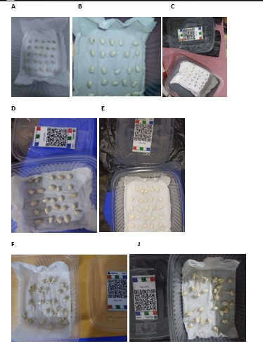

## INTRODUCCION

La germinación es un proceso fisiológico mediante el cual la semilla reanuda su actividad metabólica y da origen a una nueva planta, iniciándose con la absorción de agua y la activación de enzimas que permiten la movilización de reservas, este proceso está influenciado por diversos factores ambientales como la temperatura, la humedad, el oxígeno y la luz, los cuales determinan tanto el porcentaje como la velocidad de germinación (Finch-Savage & Leubner-Metzger, 2006). En el caso del frijol (Phaseolus vulgaris L.), una de las leguminosas más importantes a nivel mundial por su alto valor nutricional y su contribución a la seguridad alimentaria, la germinación adecuada es fundamental para lograr un buen establecimiento del cultivo (FAO, 2012)Diversos estudios han demostrado que, dependiendo de la especie, la luz puede actuar como un factor regulador de la germinación, aunque en muchas leguminosas este proceso no es estrictamente dependiente de la presencia de luz (Baskin & Baskin, 2014). En este contexto, la presente práctica tuvo como objetivo evaluar el efecto de la germinación en condiciones normales con luz y en ambiente oscuro y evaluar el porcentaje de germinación, el tiempo medio de germinación y la sincronización del proceso en semillas de frijol, planteando como hipótesis que dicho factor influye en la respuesta germinativa bajo condiciones controladas.

# MATERIALES Y METODOS

## Materiales empleados

Se utilizaron 12 recipientes plásticos con tapa, papel toalla, 1 litro de agua mineral, pinza, un total de 300 semillas de frijol (Phaseolus vulgaris L.), guantes, cinta y bolsas negras. Los recipientes permitieron mantener condiciones controladas durante el experimento, mientras que el papel toalla fue empleado como sustrato para conservar la humedad necesaria para la germinación. El agua mineral se utilizó para evitar la presencia de sales u otros compuestos que pudieran interferir en el proceso germinativo. Las pinzas facilitaron la manipulación de las semillas, reduciendo el riesgo de contaminación y daño mecánico. Las semillas se emplearon 25 por cada tratamiento. Además, un par de guantes para mantener una higiene y evitar contaminaciones al momento de la manipulación de las semillas, como también se empleo una cinta para pegar o unir las bolsas negras y forrar los taperes con la finalidad de crear un ambiente oscuro dentro del táper.

{fig-align="center" width="336"}

## Metodologia

Se colectaron un promedio de 300 semillas de frijol (Phaseolus vulgaris), estas semillas fueron colocadas sobre papel toalla previamente humedecido dentro de recipientes plásticos, asegurando condiciones adecuadas de humedad para la germinación. Se emplearon doce recipientes distribuidos en dos tratamientos: seis bajo condiciones de luz natural y seis en condiciones de oscuridad, cubriéndose estos últimos con bolsas plásticas color negro para evitar la exposición a la luz. En cada recipiente se colocaron 25 semillas, manteniendo un manejo homogéneo en todos los tratamientos y se procedió a colocar sus respectivas etiquetas. Posterior a ello se procedió a evaluar el comportamiento de cada tratamiento tanto bajo luz y sin luz, durante un periodo de siete días a temperatura ambiente (aproximadamente 25 °C), durante el cual se realizaron evaluaciones diarias registrando el número de semillas germinadas. Se consideró como semilla germinada aquella que presentó la emergencia visible de la radícula. Los datos obtenidos fueron organizados en Google sheets y posteriormente analizados mediante herramientas estadística, como el programa Rstudio determinándose las semillas germinadas, tiempo medio de germinación, índice de sincronización, velocidad de germinaciones, porcentaje de germinación, el tiempo medio de germinación y el índice de sincronización, con el fin de comparar el comportamiento germinativo entre los tratamientos evaluados. {width="463"}

# RESULTADOS Y DISCUSIONES

Resultados evaluados diariamente

<https://docs.google.com/spreadsheets/d/1rFgA4Omvtq_2Hai5-Liig_BLcCpLUiUXhNDXogkqte8/edit?gid=807318559#gid=807318559>

## Numero de semillas germinadas

Se observa que el número de semillas germinadas de frijol (Phaseolus vulgaris L.) fue similar entre los tratamientos con luz y sin luz, registrándose valores promedio cercanos a 25 semillas en ambos casos. Asimismo, ambas condiciones presentan la misma letra (“a”), lo que indica que no existen diferencias significativas entre tratamientos según el análisis estadístico realizado (p \> 0.05).

Estos resultados indican que la presencia o ausencia de luz no influye de manera significativa en la germinación del frijol, lo que sugiere que esta especie no presenta una dependencia marcada de la luz para iniciar su proceso germinativo. Este comportamiento coincide con lo reportado por Baskin y Baskin (2014), quienes señalan que muchas leguminosas pueden germinar tanto en condiciones de luz como de oscuridad debido a sus reservas internas. Asimismo, Bewley et al. (2013) indican que factores como la disponibilidad de agua y la temperatura tienen un mayor efecto sobre la germinación en comparación con la luz en este tipo de semillas.

Desde el punto de vista agronómico, estos resultados son importantes, ya que indican que el frijol puede establecerse adecuadamente bajo diferentes condiciones de siembra, sin que la luz sea un factor limitante durante la germinación, siempre que se mantengan condiciones adecuadas de humedad.

## Porcentaje de germinacion (gsp)

Se observa que el porcentaje de germinación de las semillas de frijol (Phaseolus vulgaris L.) fue alto en ambos tratamientos, alcanzando valores cercanos al 98% en condiciones con luz y ligeramente inferiores en condiciones sin luz. Sin embargo, ambas barras presentan la misma letra (“a”), lo que indica que no existen diferencias significativas entre los tratamientos según el análisis estadístico realizado (p \> 0.05).

Estos resultados confirman que la luz no ejerce un efecto significativo sobre el porcentaje de germinación en esta especie, lo cual sugiere que el frijol no presenta fotoblastismo marcado. Este comportamiento es consistente con lo reportado por Baskin y Baskin (2014), quienes indican que muchas leguminosas germinan de manera independiente de la luz debido a sus reservas internas. Asimismo, Bewley et al. (2013) mencionan que la germinación está más influenciada por factores como la disponibilidad de agua y la temperatura que por la luz en semillas no fotoblásticas.

Desde el punto de vista agronómico, un alto porcentaje de germinación en ambos tratamientos indica una buena calidad fisiológica de las semillas utilizadas, lo que favorece un establecimiento uniforme del cultivo en condiciones de campo.

{width="485"}

## Resultados evidenciados diariamente

{fig-align="center" width="358"}

# CONCLUSIONES
No se observaron diferencias significativas en el porcentaje de germinación entre los tratamientos evaluados, lo que indica que el factor analizado no influye de manera determinante en la germinación del frijol. El tiempo medio de germinación fue similar en todos los tratamientos, evidenciando que la velocidad de emergencia no se ve afectada por las condiciones evaluadas. Asimismo, el índice de sincronización mostró valores comparables, lo que indica que la uniformidad del proceso germinativo se mantiene estable. En conjunto, los resultados permiten concluir que las semillas de frijol presentan una alta capacidad de adaptación a diferentes condiciones, siempre que se garantice una adecuada disponibilidad de humedad. 

# Referencias
Baskin, C., & Baskin, J. (2014). Seeds. ScienceDirect. http://www.sciencedirect.com:5070/book/monograph/9780124166776/seeds
FAO. (2012). Política de la FAO sobre Pueblos Indígenas y Tribales.
Finch-Savage, W. E., & Leubner-Metzger, G. (2006). Seed dormancy and the control of germination. New Phytologist, 171(3), 501-523. https://doi.org/10.1111/j.1469-8137.2006.01787.x

